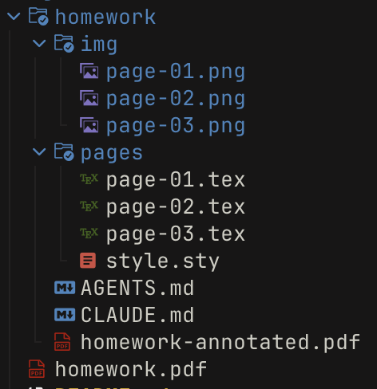
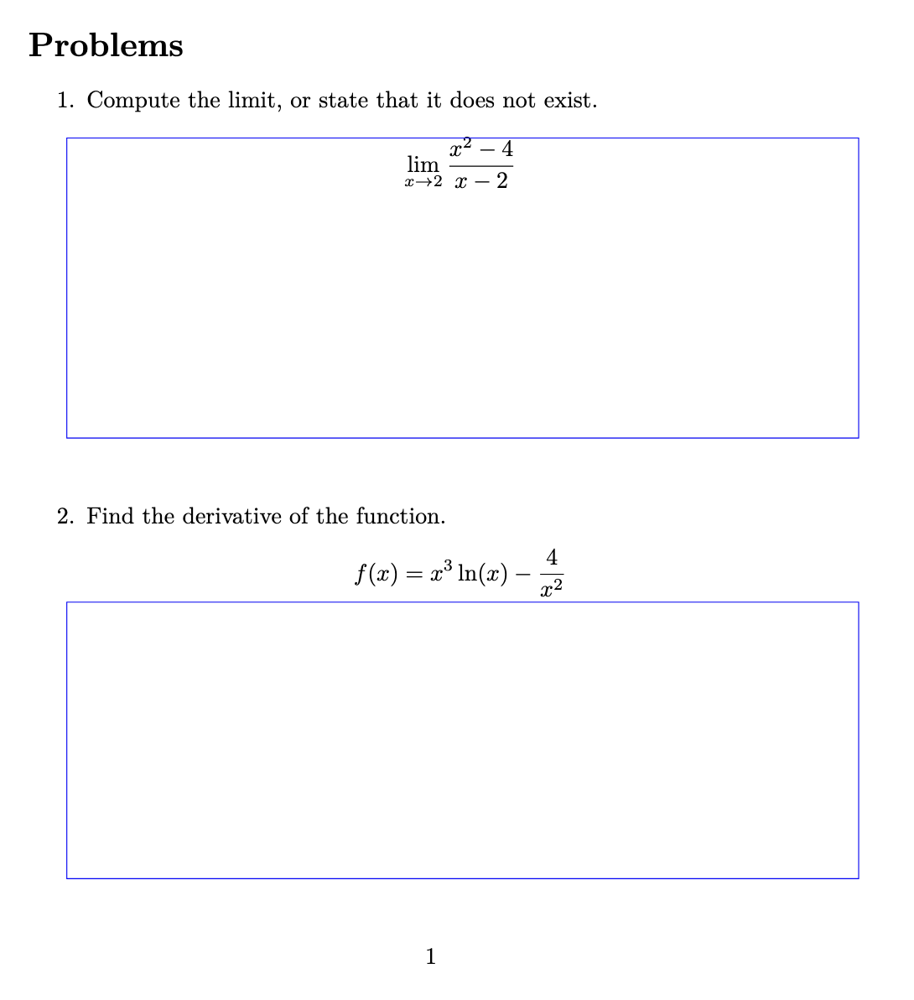
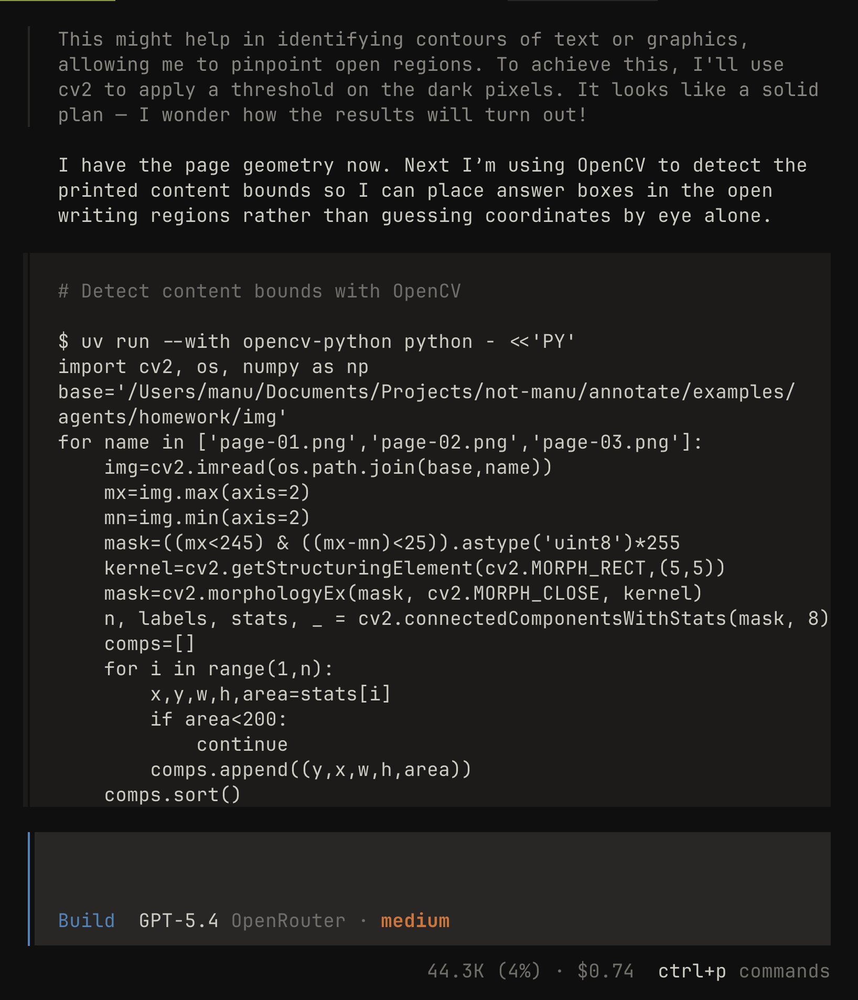
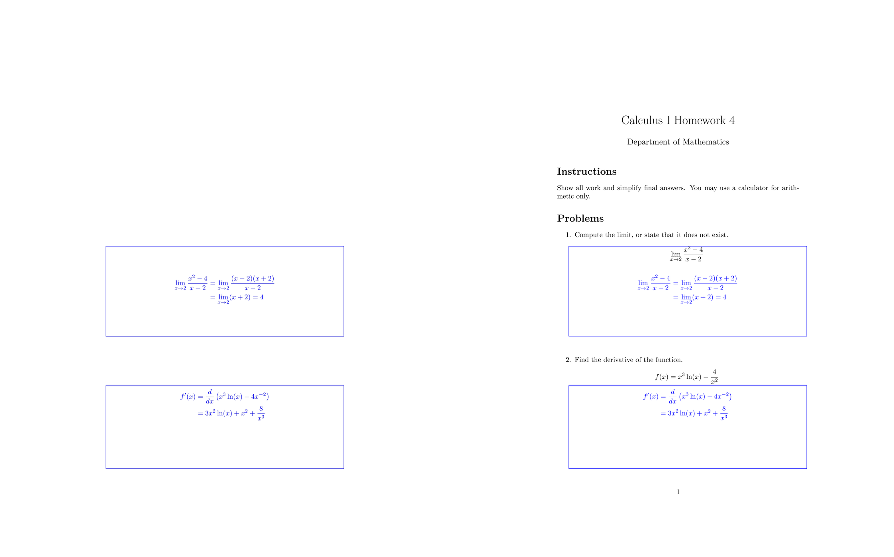

<div align="center">
<h2>Annotate</h2>
<p>Annotate your PDFs with LaTeX & Typst!</p>
</div>

<br/>

**Demo**


<br/>

<a href="https://youtube.com"></a>
**How I use it**:

I use Annotate for 90% of my homework at university! In this video I explain how I use it everyday, and how I speed up my workflow with AI agents. 

**Why?** 
- All my professors are strict with how I format my work. (I cannot modify the original PDF and must write over it!)
- I don't want to pay to print out my homework.
- I can easily resubmit changes without needing to print out a new copy.


<br/>
<br/>

<div align="center">

[Quick Start](#quick-start) 
&nbsp;&bull;&nbsp;
[Features](#features)
&nbsp;&bull;&nbsp;
[Annotating with AI Agents](#annotating-with-ai-agents)
&nbsp;&bull;&nbsp;
[How it works](#how-it-works)
&nbsp;&bull;&nbsp;
[Examples](#examples)
&nbsp;&bull;&nbsp;
[Contributing](#contributing)

</div>

<br/>
<br/>


### Quick start

**1. Install Annotate**

```sh
# Install globally
npm i -g @notmanu/annotate

# Or with pnpm / bun
pnpm add -g @notmanu/annotate
bun add -g @notmanu/annotate
```

<br />
<br />


**2. Start Watching a PDF**

Start annotating a PDF with the following command:

```sh
annotate homework.pdf -w latex 
```

This will create a new folder called `homework` with the structure shown on the right.

<br />
<br />

**3. Add some annotations!**

Edit `page-01.tex` and add a textbox inside the document:

```latex
\textbox[x=10em, y=40em, w=30em, h=10em, border]{
  \large
  Hello Annotate!
}
```

This annotate the first page with some text. The final document `homework-annotated.pdf` will automatically compile as you add annotations.

<br/>
<br/>

### Features

Write annotations in LaTeX or Typst and overlay them directly onto existing PDFs. Annotate watches your files, recompiles on every save, and produces a final annotated PDF in real time.

<br/>

**Live reload** &mdash; Edit a `.tex` or `.typ` file, save, and see the result instantly. No manual build steps.

**Per-page annotations** &mdash; Each page gets its own file (`page-01.tex`, `page-02.tex`, ...) so you only touch what you need.

**Automatic page sizing** &mdash; Overlay pages match the original PDF's dimensions. No configuration required.

**Works with your existing tools** &mdash; Any text editor, any LaTeX packages, any Typst modules. Annotate stays out of your way.

**Image generation** &mdash; Export each page as a PNG with the `--images` flag. Requires `pdftoppm` (poppler) or `mutool` (mupdf) to be installed.

**Built-in macros** &mdash; A generated `style.sty` / `style.typ` gives you positioning primitives out of the box.

<br/>
<br/>

**Supported engines**

Annotate works out of the box with your TeX distribution or with Typst.

| Engine | Language | Supported | Tested | Notes |
|--------|----------|-----------|--------|-------|
| **tectonic** | **LaTeX** | **✓** | **✓** | **Recommended, auto-downloads packages** |
| **typst** | **Typst** | **✓** | **✓** | The future of typesetting! |
| latexmk | LaTeX | ✓ | ✗ | Common in TeX distributions |
| pdflatex | LaTeX | ✓ | ✗ | Basic LaTeX engine |
| xelatex | LaTeX | ✓ | ✗ | Unicode/font support |
| lualatex | LaTeX | ✗ | ✗ | Not yet implemented |

> **Note:** Engines that are not tested should work but haven't been verified yet. If you try one, please [open an issue](https://github.com/not-manu/annotate/issues) and let me know how it goes!

<br/>
<br/>

**Built-in macros**

Every new project includes a `style.sty` (LaTeX) or `style.typ` (Typst) with helpful macros so you can start annotating right away.

<br/>

<!-- TODO: screenshot showing textbox with border on a PDF page -->


<br/>
<br/>

`\textbox` (LaTeX) / `#textbox` (Typst) is the main positioning command. Place a box at any position on the page:

```latex
\textbox[x=10em, y=40em, w=30em, h=10em, border]{
  Your annotation here!
}
```
```typst
#textbox(x: 10em, y: 40em, w: 30em, h: 10em, border: true) {
  Your annotation here!
}
```

| Option | Default | Description |
|--------|---------|-------------|
| `x` | `0pt` | Horizontal offset from top-left |
| `y` | `0pt` | Vertical offset from top-left |
| `w` | `2in` | Box width |
| `h` | `0.5in` | Box height |
| `pad` | `0pt` | Inner padding |
| `border` | off | Show a border (useful for debugging placement) |

<br/>

Other macros included in the default style:

| Macro | Description |
|-------|-------------|
| `\annotationcolor{color}` | Change the annotation text color |
| `\annotationbox[fill]{content}` | Highlighted box (default fill: yellow) |
| `\annotationlayer{...}` | TikZ overlay layer for absolute positioning |
| `\answerspace[height]` | Insert blank space for handwriting (default: 1.2in) |
| `\begin{defbox}[title]` | Definition box environment |
| `\begin{hintbox}[title]` | Hint/note box environment (default title: "Hint") |
| `definition`, `theorem`, `lemma`, `corollary` | Auto-numbered math environments |

<br/>

> Typst equivalents use function syntax: `#textbox(x: 10em, y: 40em)[content]`, `#annotation-box(content)`, `#annotation-text("text")`, `#answer-space()`. See `style.typ` for the full API.

<br/>
<br/>

### Annotating with AI Agents

Annotate is designed to work well with AI coding agents like Claude Code, Cursor, and Copilot. The workflow is simple: you set up the boxes, the agent fills them in.

<br/>

**1. Set up your project with `--agents`**

The `--agents` flag generates an `AGENTS.md`, `CLAUDE.md`, and automatically enables `--images` so the agent can *see* each page:

```sh
annotate homework.pdf -w latex --agents
```



This creates the full agent-ready project structure — `img/` holds a PNG per page so the agent can see the layout, and `AGENTS.md` / `CLAUDE.md` give it the context it needs.

You can also add `--agents` to an existing project — it will generate the missing files without overwriting anything:

```sh
annotate watch homework/ --agents
```

<br/>
<br/>
<br/>
<br/>
<br/>

**2. Place your boxes**



Add empty `\textbox` elements with `border` enabled where you want the agent to write. The border helps you visually confirm the placement before handing it off:

```latex
\textbox[x=150bp, y=350bp, w=330bp, h=120bp, pad=4pt, border]{
  Question 1.
}

\textbox[x=150bp, y=548bp, w=330bp, h=110bp, pad=4pt, border]{
  Question 2.
}
```

<br/>
<br/>
<br/>
<br/>
<br/>

**3. Customize the `AGENTS.md`**

The generated `AGENTS.md` includes sensible defaults for annotation work. Customize it to fit your workflow — this file is automatically picked up by Claude Code and similar tools:

```markdown
- Prefer `displaystyle` when possible; use `textstyle` only when space is tight.
- Remove the border from a question once it is completed.
- Do not include the question number when writing answers — provide the answer directly.
- Do not attempt to compile the document; it will be compiled automatically.
```

The agent reads the page images in `img/`, understands the layout, and fills in the LaTeX — all while Annotate recompiles in the background. See [`examples/AGENTS.md`](./examples/AGENTS.md) for a full example.

<br/>
<br/>
<br/>
<br/>
<br/>



**Automating box placement with OpenCV**


For assignments with many printed answer regions, you can skip manual box placement entirely. Let the agent write a quick Python script that detects the boxes from the page image and generates the `\textbox` coordinates automatically:

```sh
# the agent can run this without modifying your project deps
uv run --with opencv-python python detect_boxes.py
```

The script reads a page image from `img/`, finds the answer regions using contour detection, and converts the pixel coordinates into `\textbox` positions using the page dimensions. This is especially useful for worksheets with dozens of small answer boxes or checkbox grids.


<br/>
<br/>

### How it works

Annotate watches your `pages/` directory. When you save a `.tex` or `.typ` file, it recompiles only the affected page into a transparent annotation PDF. After compilation, **[pdf-lib](https://github.com/Hopding/pdf-lib)** overlays each annotation page onto the corresponding page of the original and writes out the final `*-annotated.pdf`. The original PDF is never touched.



### Examples

The [`examples/`](./examples) folder has ready-to-run projects you can use as a reference:

| Folder | Description |
|--------|-------------|
| [`examples/latex`](./examples/latex) | LaTeX homework annotation |
| [`examples/typst`](./examples/typst) | Typst homework annotation |
| [`examples/agents`](./examples/agents) | Agent-ready project with `AGENTS.md` and a full transcript |

<br/>
<br/>

### Contributing

Found a bug or want to add an engine? [Open an issue](https://github.com/not-manu/annotate/issues) or send a PR — contributions are welcome.

**Dev setup:**

```sh
bun install

# Link annotate-dev → src/index.ts (runs with Bun, no build step needed)
bun run dev:link

annotate-dev homework.pdf -w latex

# Unlink when done
bun run dev:unlink
```
