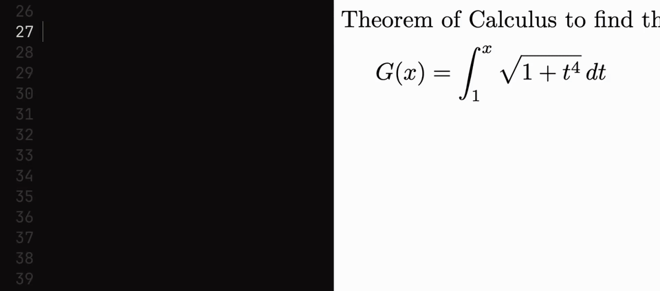
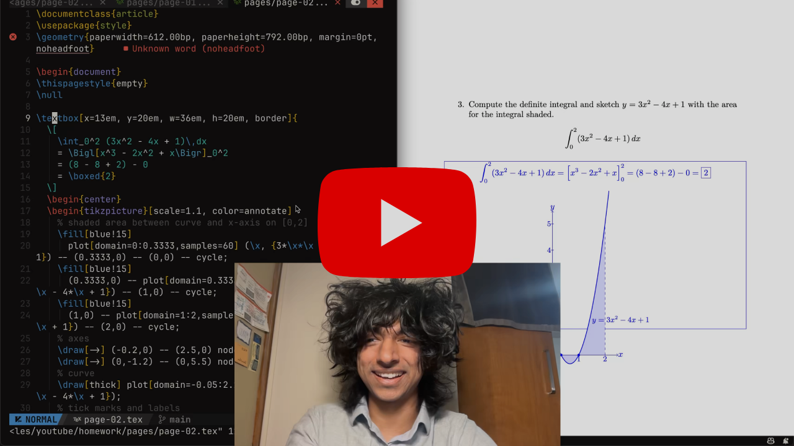
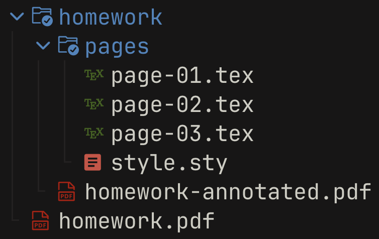
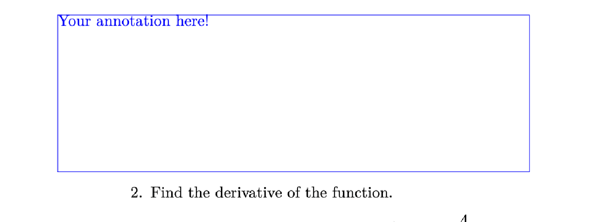

<div align="center">
<h2>Annotate</h2>
<p>Annotate your PDFs with LaTeX & Typst!</p>
</div>

<br/>

**Demo**



<br/>

<a href="https://youtube.com"></a>
**How I use it**:

I use Annotate for 90% of my homework at university! In this video I explain how I use it everyday, and how I speed up my workflow with AI agents. 

**Why?** 
- All my professors are strict with how I format my work. (I cannot modify the original PDF and must write over it!)
- I don't want to pay to print out my homework.
- I can easily resubmit changes without needing to print out a new copy.


<br/>
<br/>

<div align="center">

[Quick Start](#quick-start) 
&nbsp;&bull;&nbsp;
[Features](#features)
&nbsp;&bull;&nbsp;
[Annotating with AI Agents](#annotating-with-ai-agents)
&nbsp;&bull;&nbsp;
[How it works](#how-it-works)
&nbsp;&bull;&nbsp;
[Contributing](#contributing)

</div>

<br/>
<br/>


### Quick start

**1. Install Annotate**

```sh
# Install globally
npm i -g @notmanu/annotate

# Or with pnpm / bun
pnpm add -g @notmanu/annotate
bun add -g @notmanu/annotate
```

<br />
<br />




**2. Start Watching a PDF**

Start annotating a PDF with the following command:

```sh
annotate homework.pdf -w latex 
```

This will create a new folder called `homework` with the structure shown on the right.

<br />
<br />

**3. Add some annotations!**

Edit `page-01.tex` and add a textbox inside the document:

```latex
\textbox[x=10em, y=40em, w=30em, h=10em, border]{
  \large
  Hello Annotate!
}
```

This annotate the first page with some text. The final document `homework-annotated.pdf` will automatically compile as you add annotations.

<br/>
<br/>

### Features

Annotate lets you write annotations in LaTeX or Typst and overlay them directly onto existing PDFs. It watches your files, recompiles on every save, and produces a final annotated PDF in real time -- no manual build steps, no fiddling with coordinates in a GUI.


<!--  -->

- **Live reload** -- edit a `.tex` or `.typ` file, save, and see the result instantly.
- **Works with your existing tools** -- use any text editor, any LaTeX packages, any Typst modules. Annotate stays out of your way.
- **Per-page annotations** -- each page gets its own file (`page-01.tex`, `page-02.tex`, ...) so you only touch what you need.
- **Automatic page sizing** -- overlay pages match the original PDF's dimensions, no configuration required.
- **Image generation** -- optionally export each page as a PNG with the `--images` flag (requires `pdftoppm` or `mutool`).
- **Built-in macros** -- a generated `style.sty` / `style.typ` gives you positioning primitives out of the box.

<br/>

<!-- TODO: screenshot of live reload in action -->

<br/>
<br/>

**Supported engines**

Annotate should work out of the box with your TeX distribution or with Typst.

| Engine | Language | Supported | Tested | Notes |
|--------|----------|-----------|--------|-------|
| **tectonic** | **LaTeX** | **✓** | **✓** | **Recommended, auto-downloads packages** |
| **typst** | **Typst** | **✓** | **✓** | The future of typesetting! |
| latexmk | LaTeX | ✓ | ✗ | Common in TeX distributions |
| pdflatex | LaTeX | ✓ | ✗ | Basic LaTeX engine |
| xelatex | LaTeX | ✓ | ✗ | Unicode/font support |
| lualatex | LaTeX | ✗ | ✗ | Not yet implemented |

> **Note:** Engines that are not tested should work but haven't been verified yet. If you try one, please [open an issue](https://github.com/not-manu/annotate/issues) and let me know how it goes!

<br/>

**Built-in macros**

Every new project comes with a `style.sty` (LaTeX) or `style.typ` (Typst) that includes helpful macros so you can start annotating right away.

<br/>

<!-- TODO: screenshot showing textbox with border on a PDF page -->


<br/>
<br/>

```latex
\textbox[x=10em, y=40em, w=30em, h=10em, border]{
  Your annotation here!
}
```
```typst
#textbox(x: 10em, y: 40em, w: 30em, h: 10em, border: true) {
  Your annotation here!
}
```

`\textbox` (LaTeX) / `#textbox` (Typst) -- the main annotation command. Place a box at any position on the page:


| Option | Default | Description |
|--------|---------|-------------|
| `x` | `0pt` | Horizontal offset from top-left |
| `y` | `0pt` | Vertical offset from top-left |
| `w` | `2in` | Box width |
| `h` | `0.5in` | Box height |
| `pad` | `0pt` | Inner padding |
| `border` | off | Show a border (useful for debugging placement) |

<br/>

Other macros included in the default style:

| Macro | Description |
|-------|-------------|
| `\annotationcolor{color}` | Change the annotation text color |
| `\annotationbox[fill]{content}` | Highlighted box (default fill: yellow) |
| `\annotationlayer{...}` | TikZ overlay layer for absolute positioning |
| `\answerspace[height]` | Insert blank space for handwriting (default: 1.2in) |
| `\begin{defbox}[title]` | Definition box environment |
| `\begin{hintbox}[title]` | Hint/note box environment (default title: "Hint") |
| `definition`, `theorem`, `lemma`, `corollary` | Auto-numbered math environments |

<br/>

> Typst equivalents use function syntax: `#textbox(x: 10em, y: 40em)[content]`, `#annotation-box(content)`, `#annotation-text("text")`, `#answer-space()`. See `style.typ` for the full API.
